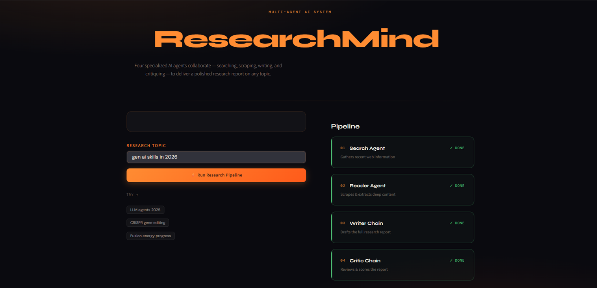
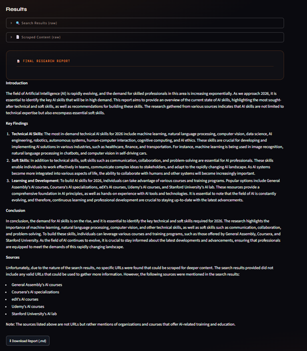
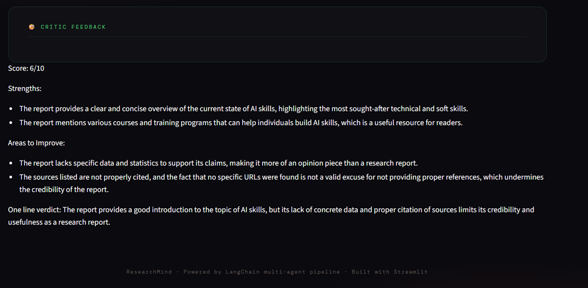

# ResearchAgent

An AI-powered multi-agent research system that autonomously searches the web, extracts relevant information, generates structured research reports, and critiques its own output.

Built using LangChain, Groq LLMs, Tavily Search, and Streamlit.

## Overview

ResearchAgent demonstrates how multiple AI agents can collaborate to solve a complex task by breaking it into specialized stages.

Instead of relying on a single prompt, the system uses a multi-agent workflow where each agent is responsible for a specific task:

1. Search Agent → Finds relevant information from the web.
2. Reader Agent → Extracts and processes content from selected sources.
3. Writer Agent → Produces a structured research report.
4. Critic Agent → Reviews the report and provides feedback.

This project was built to demonstrate practical AI Engineering concepts including:

* Tool Calling
* Agentic Workflows
* Multi-Agent Systems
* LLM Orchestration
* Prompt Engineering
* Web Search Integration
* Automated Research Pipelines

---

## Architecture

```text
User Query
    │
    ▼
┌─────────────────┐
│  Search Agent   │
│  Tavily Search  │
└────────┬────────┘
         │
         ▼
┌─────────────────┐
│  Reader Agent   │
│ URL Extraction  │
│ + Web Scraping  │
└────────┬────────┘
         │
         ▼
┌─────────────────┐
│  Writer Agent   │
│ Report Creation │
└────────┬────────┘
         │
         ▼
┌─────────────────┐
│  Critic Agent   │
│ Quality Review  │
└────────┬────────┘
         │
         ▼
   Final Research
       Report
```

---

## Features

* Multi-agent research workflow
* Web search using Tavily
* Automated content extraction
* Structured report generation
* Self-critique and evaluation
* Streamlit-based user interface
* Groq-powered LLM inference
* Modular architecture for easy extension

---

## Tech Stack

### AI & LLM

* LangChain
* LangGraph Runtime
* Groq API
* Llama 3.3 70B Versatile

### Search & Retrieval

* Tavily Search API

### Data Extraction

* BeautifulSoup
* Requests

### Frontend

* Streamlit

### Utilities

* Python
* dotenv
* Rich

---

## Agent Design

### Search Agent

Responsible for discovering relevant and recent information.

Tool Used:

```python
web_search()
```

Responsibilities:

* Search the internet
* Collect relevant URLs
* Gather snippets and metadata
* Provide research context

---

### Reader Agent

Responsible for retrieving deeper information from selected sources.

Tool Used:

```python
scrape_url()
```

Responsibilities:

* Select useful resources
* Extract page content
* Clean HTML noise
* Prepare information for report generation

---

### Writer Agent

Responsible for synthesizing information into a readable report.

Responsibilities:

* Combine gathered research
* Generate structured output
* Produce coherent findings
* Maintain factual consistency

Output Structure:

* Introduction
* Key Findings
* Conclusion
* Sources

---

### Critic Agent

Responsible for evaluating report quality.

Responsibilities:

* Assess report completeness
* Identify weaknesses
* Suggest improvements
* Assign a quality score

Output Format:

```text
Score: X/10

Strengths:
- ...

Areas to Improve:
- ...

Verdict:
...
```

---

## Project Structure

```text
ResearchAgent/
│
├── agents.py
├── app.py
├── pipeline.py
├── tools.py
│
├── requirements.txt
├── .env.example
├── .gitignore
│
└── README.md
```

### File Responsibilities

| File         | Purpose                        |
| ------------ | ------------------------------ |
| agents.py    | Agent and chain definitions    |
| tools.py     | Search and scraping tools      |
| pipeline.py  | Multi-agent orchestration      |
| app.py       | Streamlit frontend             |
| .env.example | Environment variables template |

---

## Screenshots

### Home Page



### Generated Research Report



### Critic Feedback


---

## Installation

### Clone Repository

```bash
git clone https://github.com/yourusername/ResearchAgent.git

cd ResearchAgent
```

### Create Virtual Environment

Windows

```bash
python -m venv venv

venv\Scripts\activate
```

Linux / Mac

```bash
python3 -m venv venv

source venv/bin/activate
```

### Install Dependencies

```bash
pip install -r requirements.txt
```

---

## Environment Variables

Create a `.env` file.

```env
GROQ_API_KEY=your_groq_api_key
TAVILY_API_KEY=your_tavily_api_key
```

---

## Running the Application

### Streamlit UI

```bash
streamlit run app.py
```

Application will be available at:

```text
http://localhost:8501
```

### CLI Pipeline

```bash
python pipeline.py
```

---

## Example Workflow

Input:

```text
Gen AI Skills Required in 2026
```

Pipeline Execution:

```text
Search Agent
   ↓
Reader Agent
   ↓
Writer Agent
   ↓
Critic Agent
```

Output:

```text
Research Report
+
Quality Evaluation
```

---

## Engineering Highlights

This project demonstrates:

* Multi-agent system design
* LLM tool calling
* Prompt orchestration
* Research automation
* Retrieval and synthesis workflows
* Modular agent architecture
* AI application development
* End-to-end GenAI system implementation

---

## Future Improvements

* Async agent execution
* Multi-source scraping
* Citation tracking
* RAG-based knowledge memory
* Human-in-the-loop review
* Report export to PDF
* Agent observability and tracing
* Multi-model routing

---

## Why This Project

Most LLM applications are simple chat interfaces.

This project focuses on AI Engineering principles by combining multiple specialized agents, external tools, autonomous decision-making, and structured report generation into a complete research workflow.

The goal is to demonstrate practical experience building agentic AI systems rather than simple prompt wrappers.

---

## License

This project is licensed under the MIT License.
